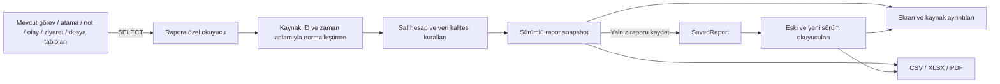

# Kagu Saha rapor sistemi: araştırma ve uygulama planı

Tarih: 6 Ekim 2026. İncelenen dal: `codex/upload-timeline-release`. İncelenen commit: `0e0fc4c`.

Uygulama güncellemesi: kullanıcı daha sonra planın uygulanmasını istedi. Kod değişiklikleri ve kabul sınırları [uygulama ve kabul kaydında](RAPOR_SISTEMI_UYGULAMA_VE_KABUL.md) açıklanır. Aşağıdaki bulgular araştırma anındaki durumu kaydeder.

Bu belge bir araştırma ve uygulama planıdır. Uygulama kodu, veri modeli, görev işleyişi veya mevcut kayıtlar değiştirilmedi. Canlı veritabanına bağlanılmadı; uygulama, worker, migration ve veri düzeltme komutları çalıştırılmadı.

## 1. Sonuç ve bağlayıcı sınır

Sistem raporlanabilir veriyi önemli ölçüde tutuyor. Eksik olan, bu verileri yöneticinin sorularını cevaplayacak biçimde birleştiren, sayıların kapsamını açıklayan ve her toplamı kaynak kayda bağlayan rapor katmanı.

Öneri: mevcut kayıt akışlarını koruyarak, **yalnız rapor modülünün okuma, hesaplama ve sunum katmanını geliştirmek**. İlk sürüm mevcut tablolarla hazırlanabilir; şema değişikliği gerektiren bir çekirdek ihtiyaç bulunmadı.

Bağlayıcı kurallar:

- Günlük planlama, atama kilitleri, varış/ayrılış, not zorunluluğu, ekip beyanı/düzeltmesi, ziyaret ve dosya kayıt kuralları aynen korunur.
- Oturum/roller, personel ekranları, çevrimdışı kuyruk, yükleme protokolü, medya worker'ı ve otomatik görev kapanışı değiştirilmez.
- Rapor hesabı operasyonel tablolara yazmaz. Kullanıcı raporu kaydettiğinde yalnız yeni bir `SavedReport` oluşturulur.
- Eski kayıtlı raporlar yeniden hesaplanmaz, JSON içerikleri güncellenmez; yeni hesap sürümü ayrı üretilir.
- Eksik tarihsel veri bugünkü kişi sayısı, rol veya ekip bilgisiyle doldurulmaz.
- Veri tutarlılığı sorunları raporda görünür hale getirilir; rapor üzerinden kayıt düzeltme akışı eklenmez.
- Değişiklikler küçük, ayrı incelenebilir aşamalara bölünür. Operasyonel regresyon veya ölçülen yük artışı kabul sınırını aşarsa yeni rapor üretimi açılmaz.

**Mevcut yan etki:** rapor sayfası ortak `AdminLayout` üzerinden açılırken `completeStaleOnSiteTasks()` çalışıyor. Bu işlem geçmiş `ON_SITE` görevlerin yalnız durumunu `COMPLETED` yapıyor. Dolayısıyla mevcut rapor ekranının tamamını salt okunur diye tanımlamak doğru olmaz. Araştırmada bu nedenle ekran/DB açılmadı. Ortak layout ve rollover davranışını değiştirmek bu planın kapsamında değildir; yeni rapor okuyucusu ve API hesabı bu işlemi çağırmamalıdır. Kaynak: `app/(admin)/admin/layout.tsx:15`, `lib/tasks/rollover.ts:4`.

## 2. Araştırma kapsamı ve kanıt sınırı

İncelenen alanlar: Prisma modeli ve indeksler; rapor sayfaları/API/hesap/snapshot/çıktılar; günlük görev ve personel kayıt yolları; ekip snapshot'ları; ziyaretlerin yeni ve eski kaynakları; not/timeline/dosya ilişkileri; çevrimdışı zamanlar; erişim kuralları; ilgili testler ve CI.

Rapor hesabı, veri anlamı ve modül izolasyonu üç ayrı incelemeyle karşılaştırıldı. Teknik tasarım için Prisma v6, PostgreSQL ve OWASP'ın birincil belgeleri de kontrol edildi; bağlantılar ilgili kararların yanında verildi.

Kesin bulgular kaynak koda ve saf hesap çağrılarına dayanıyor. Üretimdeki veri hacmi, eksik kayıt oranları, gerçek sorgu süreleri, cihazlarda bekleyen kayıtlar ve kullanıcıların öncelik sırası henüz ölçülmedi. Aşağıdaki performans riskleri ölçülmüş canlı yavaşlık olarak sunulmamalı. Önceki V1.1 yol haritasının başlangıç bulguları güncel sürümün eksik listesi yerine kullanılmadı.

## 3. Mevcut rapor sisteminde zaten bulunanlar

| Özellik | Güncel durum |
| --- | --- |
| Rapor tipleri | Proje, personel/ekip, cari saha ve ziyaret |
| Filtreler | Tarih, proje, cari, kullanıcı, ekip, işgücü türü, görev durumu, aktif/arşiv |
| Üretim | Önizleme ve kaydetme; kaydetme sırasında güncel veri yeniden okunuyor |
| Hesap | Plan katılımı, varış, fiili ekip beyanı, kişi/gün ve ekip/gün ayrımı |
| Veri belirsizliği | Eksik süre ve tarihsel sınıf/mevcud için bazı sayaç ve uyarılar |
| Tarihsel koruma | Ekip adı/sayı/sınıf atama snapshot'ları; eski SavedReport tekrar hesaplanmıyor |
| Ziyaret | Yeni ProjectVisit ile eski program ziyaretleri birlikte; yeni kaydın timeline karşılığı sayılmıyor |
| Arşiv | Başlık arama, tip filtresi, 25 kayıtlık sayfalama |
| Çıktı | Excel uyumlu CSV; tarayıcı yazdırma üzerinden PDF |

Kaynaklar: `lib/reports/build.ts:10`, `lib/reports/calculations.ts:98`, `lib/reports/snapshot.ts:18`, `components/admin/reports-dashboard.tsx:27`, `app/(admin)/admin/reports/page.tsx:13`.

Bu temel korunmalı. İyileştirme, var olan özellikleri yeniden yazmaktan çok doğruluk açıklarını kapatmalı ve kullanılmayan veriyi rapora taşımalıdır.

## 4. Veri envanteri ve doğru kullanım

| Kaynak | Tuttuğu veri | Raporlanabilecek bilgi | Anlam sınırı |
| --- | --- | --- | --- |
| Customer / Project | Cari, proje, şehir, açıklama, iletişim, konum, aktiflik | Proje/cari portföyü ve faaliyet dağılımı | Ad/aktiflik/iletişim değerlerinin tam tarihçesi yok; güncel bilgi olarak etiketlenir |
| DailyTask | Görev günü, başlık, yönetici notu, durum, varış/ayrılış, süre | Günlük plan, başlayan/kapanan görev, ortak görev penceresi | Süre ve durum göreve ortaktır; kişisel puantaj değildir |
| DailyTaskAssignee | Kullanıcı/ekip, ekip adı, plan mevcudu, fiili mevcud, işgücü sınıfı snapshot'ı | Plan ataması, ekip beyanı, hesaplı kişi/gün, ekip/gün | Eski null alanlar bilinmiyor; hesapsız çalışanların kimlikleri yok |
| Team / User | Güncel ekip ve kullanıcı tanımı | Kimlik bağlantıları, güncel etiketler | Bugünkü rol/sayı geçmiş sınıf ve mevcudun kanıtı değildir |
| TaskEvent | Görev olayı, yapan kişi, not, olay konumu, zaman | Kaydı yapan kişi ve saha olayı ayrıntısı | Her olay türü/yol için eksiksiz tek kaynak değildir; timeline ile körlemesine toplanmaz |
| ProjectTimelineEvent | Proje/görev/ziyaret olayları, not, dosya bağı, aktör, zaman | Faaliyet günlüğü; görev/ziyaret notlarının bağlamı | Aynı eylemin başka tablolardaki karşılığı olabilir; bazı açıklamalar serbest metindir |
| ProjectNote | Proje, kişi, not, zaman | Proje not arşivi ve ek bağlam | Görev/ziyaret ID'si yok; proje açıklaması kaydı da bulunabilir; tek başına günlük iş notu sayacı olamaz |
| ProjectVisit | Proje, ziyaret eden, ziyaret zamanı, not, olay konumu | Ziyaret sayısı, ziyaret edilen proje, son ziyaret ve kontrol aralığı | Ziyaret bir işgücü veya çalışma süresi kaydı değildir |
| ProjectFile | Proje/görev/ziyaret bağı, yükleyen, ad, MIME, boyut, not, kayıt zamanı | Medya/belge envanteri, görev ve ziyaret eki, yükleyen katkısı | Kayıt/yayın zamanı fotoğrafın çekim zamanı değildir; bağı olmayan dosya göreve tahminen atanmaz |
| UploadSession / medya job'ları | Aktarım/işleme durumu, denemeler, zamanlar | Sunucunun bildiği bekleyen veya başarısız medya işlemleri | Tek dosyanın oturum/job/yayın kaydı üç ayrı dosya sayılmaz; ayrıntılı teknik hatalar dış rapora konmaz |
| OfflinePendingItem | İşlem makbuzu, payload, sunucu kayıt/senkronizasyon zamanı | Uygun makbuzlarda gecikmiş senkronizasyon bilgisi | Merkezî cihaz kuyruğu değildir; cihazda gönderilmemiş kayıtların tamamını göstermez |
| SavedReport | Dönem, filtrelerin snapshot'ı, üreten, zaman, sabit rapor verisi | Rapor arşivi ve aynı çıktıların yeniden alınması | Kaydedilmiş değerler güncel operasyonel veriyle değiştirilemez |

Kaynaklar: `prisma/schema.prisma:86`, `:128`, `:141`, `:171`, `:191`, `:206`, `:233`, `:270`, `:291`, `:317`, `:337`, `:428`, `:458`.

### Zamanları birbirinden ayırma

- **Görev günü:** `taskDate`; plan ve görev bazlı raporların dönem anahtarı.
- **Personel olay zamanı:** çevrimdışı senkronizasyonda `occurredAt`, olayın `createdAt` alanına yazılabiliyor. Veritabanına geliş zamanı ile aynı olmayabilir.
- **Ziyaret zamanı:** ProjectVisit `visitedAt`; eski program ziyaretlerinde timeline zamanı. Bu kayıt yollarının tarih anlamı raporda belirtilir.
- **Medya kayıt zamanı:** ProjectFile `createdAt`; HEIC dönüşümü sonradan yayınlayabilir. Göreve bağlı ek, ilgili görev raporunda gösterilir; medya dönem raporunda kendi kayıt zamanıyla yer alır.
- **Senkronizasyon zamanı:** uygun sunucu makbuzunun `createdAt/syncedAt` bilgisi; her tarihsel olayla kesin birebir bağ kurulamayabilir.
- **Rapor üretim zamanı:** verinin okunduğu görünüm ve snapshot oluşturma zamanı; raporun hangi anda bilinen kayıtlara dayandığını açıklar.

Kaynak: `app/api/offline/sync/route.ts:65`, `:73`, `:129`; `lib/offline/server-operation.ts:22`; `lib/files/media-processing.ts:86`.

Sonradan gelen çevrimdışı kayıt geçmiş bir dönemin yeni oluşturulan raporunu değiştirebilir; önceden kaydedilmiş raporu değiştiremez. Sunucuda bekleyen makbuz sayısının sıfır olması bütün cihazların senkron olduğu anlamına gelmez. Gerçek cihaz kuyruğu IndexedDB'dedir (`lib/offline/queue.ts:397`).

**Silinen kayıtlar için tarihsel sınır:** mevcut akışta planlı görev veya proje silinebilir. Bazı bağlı kayıtlar cascade silinir, bazı timeline görev bağlantıları null kalır. Canlı tablolardan geçmişte oluşturulmuş ve sonra silinmiş bütün görevleri veya portföyü eksiksiz yeniden kurmak mümkün değildir. Raporda “mevcut kayıtlar içindeki dönem faaliyeti” kapsamı kullanılır; geçmiş SavedReport korunur. Silme/arşivleme işleyişi bu çalışma için değiştirilmez. Kaynak: `app/(admin)/admin/schedule/actions.ts:231`, `app/(admin)/admin/projects/new/actions.ts:303`, Prisma ilişkilerinin onDelete kuralları.

## 5. Güncel açıklar ve öncelikleri

| Öncelik | Bulgu | Etki | Rapor kapsamındaki çözüm |
| --- | --- | --- | --- |
| P1 | Tarihsel sınıfı null atama, bugünkü kullanıcı rolü OBSERVER ise belirsiz atama sayısından da çıkıyor | Kullanıcı rolü değişince geçmiş dönemin yeni rapor hesabı değişebilir | Null tarihsel sınıfı ayrı belirsizlik olarak koru; bilinen observer snapshot'ını işgücünden çıkar |
| P1 | CSV'de dönem, rapor ID, oluşturulma zamanı ve hesap sürümü bulunmuyor | Aynı başlıklı dönem dosyaları güvenle ayırt edilemiyor | Bütün çıktılara ortak rapor kimliği ve metadata ekle |
| P1 | Notlar, iş açıklamaları, olaylar ve dosya bağlamı görev/proje/cari raporuna yeterince taşınmıyor | Yönetici “ne yapıldı, kim kaydetti, hangi kanıt var?” sorularını başka ekranlardan topluyor | Kaynak kayda bağlı faaliyet/not/ek ayrıntıları ekle |
| P2 | Personel/ekip satırının türü ve adı ilk kayıttan belirleniyor | Dönem içindeki sınıf/ad değişimi görünmeyebilir | Tarihsel tür dağılımı veya alt satırlar göster; kimlik ile görüntü etiketini ayır |
| P2 | Süre kontrolü iki zamanın varlığı ve negatif olmayan saklı süre ile sınırlı | Ters zaman veya süre uyuşmazlığı uyarılmadan toplamı etkileyebilir | Rapor kalite kontrolü ekle; kaynak kaydı değiştirme |
| P2 | Personel satırlarında ortak görev süresi tekrar görünür; genel toplamda görev bir kez sayılır | Satırları toplamak genel toplamı vermeyebilir | Toplanabilir ve tekilleştirilen metrikleri açıkça ayır; toplamı kaynak seviyesinde hesapla |
| P2 | Ayrıntıda görev ID/başlık, saatler, notlar ve dosya kimliği yok | Aynı proje/günün farklı görevleri çıktıda zor ayırt edilir | Görev, atama, olay ve dosya için ayrı ayrıntı tabloları |
| P2 | Görevi olmayan proje/cariler görev raporunda yok | Faaliyetsiz portföy görünmüyor | İsteğe bağlı sıfır faaliyetli proje/cari listesi |
| P2 | Arşivde 25 raporun tüm JSON'u istemciye taşınıyor | Büyük raporlar liste açılışını ağırlaştırabilir | Arşivde metadata; tam snapshot yalnız detay isteğinde |
| P2 | Ziyaret sınırı bütün sonuçlar alındıktan sonra denetleniyor | Büyük dönemlerde bellek ve DB yükü sınırdan önce oluşur | Rapora özel sınırlı okuyucu; toplam ve ayrıntı için açık limit politikası |
| P2 | Eğilim, dönem karşılaştırması, rapor içi sıralama/arama ve veri kalitesi görünümü yok | Mevcut ekran daha çok form ve arşiv görevi görüyor | Türlere uygun analiz ve kaynak ayrıntıları |
| P3 | API preview dışındaki operation değerlerini kayıt olarak kabul ediyor | Eksik/geçersiz işlem yanlışlıkla SavedReport oluşturabilir | Yalnız preview/save kabul eden rapor API doğrulaması |
| P3 | PDF tarayıcı yazdırmasına dayanıyor | Uzun/geniş raporun sayfa düzeni doğrulanmalı | Rapor özelinde baskı şablonu ve görsel kabul |

Kanıtlar: `lib/reports/calculations.ts:46`, `:60`, `:123`, `:147`, `:162`; `lib/reports/export.ts:13`; `lib/reports/build.ts:43`, `:71`; `app/(admin)/admin/reports/page.tsx:27`; `app/api/admin/reports/route.ts:17`; `components/admin/print-report-button.tsx:8`.

Salt bellekte doğrulanan üç örnek:

1. Aynı null snapshot'lı atamada güncel rol PERSONNEL iken `unknownAssignments=1`; yalnız güncel rol OBSERVER yapılınca `0`.
2. Aynı kullanıcının farklı günlerde PERSONNEL ve OBSERVER snapshot'ları varsa personel raporu tek satırı ilk türle etiketliyor.
3. `leftAt < arrivedAt` olsa bile pozitif saklı `durationMinutes=120` mevcut süre yardımcısı tarafından kabul ediliyor.

Bunlar hesap/kalite denetimi açıklarıdır; üretimde bu örneklerin bulunduğu iddiası değildir.

## 6. Metrik sözlüğü

Her metrik için ad, birim, kayıt seviyesi, dönem alanı, filtre kapsamı, toplama yöntemi ve eksik veri kapsamı tanımlanmalıdır.

| Metrik | Hesap/anahtar | Gösterim kuralı |
| --- | --- | --- |
| Plan kapsamındaki görev | Seçili taskDate dönemindeki benzersiz görev ID'si | Bütün durumları kapsar; yalnız PLANNED sayısıyla karıştırılmaz |
| PLANNED durumundaki görev | `status=PLANNED` | Güncel durum etiketidir; gecikmiş varış kaydıyla birlikte bulunabilir, kesin “henüz başlamadı” anlamına gelmez |
| Varış kaydı olmayan görev | `arrivedAt=null` | Seçili görev kümesinde varış kaydı yoktur; durum sayacından ayrı ölçülür |
| Varış kaydı olan görev | `arrivedAt` bulunan benzersiz görev | Bütün atanmış kişilerin varışını kanıtlamaz |
| Kapanmış görev | `status=COMPLETED` | İşin ticari olarak bitmesi veya fiziksel ilerleme yüzdesi değildir |
| Ayrılışı kayıtlı görev | Geçerli varış/ayrılış çifti | Kapanmış ama ayrılışı olmayan görev ayrıca gösterilir; kesin kapanış nedeni uydurulmaz |
| Ölçülmüş ortak görev süresi | Geçerli zaman/süreye sahip görevlerin dakikası; görev bir kez | Kişisel çalışma süresi ve adam-saat değildir; geçersiz/eksik kayıtlar ayrı |
| Plan atama katılımı | Bilinen personel/ekip snapshot sayıları, görev-atama bazında | Aynı proje/günün iki görevi iki katılım oluşturabilir; benzersiz çalışan değildir |
| Hesaplı kişi/gün | Tarihsel PERSONNEL atamalarında kullanıcı ID + görev günü | Atama ölçüsüdür; fiili devam/puantaj değildir |
| Ekip/gün | Ekip ID + görev günü; ID yoksa açıkça etiketlenmiş temsilci vekil anahtarı | Anonim ekip üyelerinin şirket çapındaki benzersizliğini kanıtlamaz |
| Fiili ekip katılım beyanı | Varışlı görevde ilgili contractor atamasının actualHeadcount değeri | Null beyan eksik, 0 geçerli beyan; görev varışı tek başına ilgili ekibin kişisel varış kanıtı değildir |
| Ekip mevcudu/gün | Aynı ekip/günün beyanları tek değer ise o değer | Çelişen beyan ayrı gösterilir; eksik beyan varsa kapsam uyarısı bulunur |
| Ziyaret / ziyaret edilen proje | Birleşik ziyaret kaydı / benzersiz proje ID'si | İki ziyaret bir şantiye olabilir; not veya dosya yüklemek ziyaret değildir |
| Son ziyaret yaşı | Bitiş günü sonuna kadar bilinen son ziyaret, İstanbul takvim günleri | 0–15 normal, 16–30 uyarı, 31+ gecikme; hiç ziyaret yok ayrı |
| Not faaliyeti / ek | Bağlı canonical not olayı / benzersiz ProjectFile ID'si | Notun kaynağı ve başlığı gösterilir; çalışma anlatımı, yönetici notu ve düzeltme açıklaması aynı anlamda sayılmaz; mirror olay tekrar sayılmaz |
| Veri kapsamı | Bilinen/bilinmeyen/geçersiz kayıt sayıları ve payda | Bir kısmi toplam kesin toplam gibi sunulmaz |

Örnek: 5 kişilik aynı ekip aynı gün iki projeye giderse 10 görev-atama katılımı, 1 ekip/gün ve tutarlı beyanla 5 ekip mevcudu/gün oluşabilir. Bu değerlerin hiçbiri kimlikleri bilinmeyen çalışanların kesin şirket toplamı değildir.

NOTE_ADDED bir yapılan iş miktarı ölçümü değildir. Yönetici ekip mevcudu düzeltmesinin açıklaması da bu türde kaydediliyor (`app/(admin)/admin/schedule/actions.ts:292`). Rapor mevcut aktör, bağlam ve başlığı gösterir; kaynakta kesin alt tür yoksa “iş yapıldı” sınıfı uydurmaz. Proje açıklaması arşivi ve çalışma anlatımları aynı toplamda iş üretimi olarak sunulmaz.

Aynı 120 dakikalık görev iki personel satırında bağlam olarak görünebilir; genel görev süresi yine 120 dakikadır. Kişi satırları toplanarak 240 dakikalık kişisel çalışma sonucu üretilmez. Proje/cari satırlarındaki tekilleştirilmiş kişi/gün değerleri de şirket toplamına körlemesine eklenmez.

“Planın uygulanması” oranı gösterilecekse pay/payda açık yazılır: örneğin günü geçmiş plan görevleri içinde varış kaydı bulunan görevlerin oranı. Gelecek günler ve devam eden gün ayrı tutulur. Durum filtresi paydanın kapsamını değiştiriyorsa oran yeniden adlandırılır veya gösterilmez. Görev durumu tarihçesi tam olmadığından eski bir tarihin kesin dönem sonu durumu iddia edilmez; rapor mevcut kayıt durumunu gösterir. Geçmiş güne gecikmiş varış geldiğinde arrivedAt dolabilir fakat mevcut akış statusu değiştirmeyebilir; PLANNED durumuna bakarak varışı yok saymak doğru değildir (`app/api/offline/sync/route.ts:65`, `:86`).

### Bu verilerle güvenilir biçimde üretilemeyecek sonuçlar

Kesin kişisel puantaj/maaş, gerçek benzersiz anonim çalışan sayısı, toplam fiili adam-saat, saat bazında işe geç kalma, yol süresi/rota, sürekli GPS takibi, üretim verimliliği, fiziksel proje tamamlanma yüzdesi, bütçe/maliyet/kârlılık ve tüm cihazların senkronizasyon durumu. Kaynak veri veya ayrı iş kuralları olmadığı için bu plan bunları eklemez. “Cari” raporu saha faaliyet raporudur; muhasebe raporu değildir.

## 7. Önerilen rapor kataloğu

| Rapor | Cevapladığı soru | İçerik | Öncelik |
| --- | --- | --- | --- |
| Operasyon özeti | Seçili dönemde hangi işler planlandı ve hangi kayıtlar oluştu? | Görev durumları, varış/ayrılış, ortak süre, not/ek kapsamı, eksikler, günlük dağılım | İlk teslim |
| Proje saha faaliyet dosyası | Bu projede ne yapıldı, kim kaydetti, kanıtı ne? | Proje/cari bilgisi, görev başlığı/yönetici notu, atamalar, iş notları, olaylar, ziyaretler, ek envanteri | İlk teslim |
| Personel / ekip katılımı | Kim nereye atandı; hangi ekip mevcudu beyan edildi? | Kullanıcı ve ekip ayrı alt görünümü; gün-proje matrisi; plan/fiili/eksik/çelişkili beyan; tür dağılımı | İlk teslim |
| Cari saha özeti | Bir carinin hangi projelerinde faaliyet var/yok? | Proje dağılımı, görev/ziyaret/not/ek, kaynak projeye geçiş; faaliyetsiz projeler | İlk teslim |
| Ziyaret ve kontrol kapsamı | Hangi şantiyeler ziyaret edildi veya kontrol aralığı uzadı? | Dönem ziyaret listesi, son ziyaret, hiç ziyaret edilmeyen aktif projeler, ziyaret notları/ekleri | İlk teslim |
| Veri kalitesi | Hangi sonuçlar eksik veya kuşkulu kayda dayanıyor? | Bilinmeyen snapshot, eksik/ters süre, beyan eksikleri/çelişkileri, bağsız dosya, kaynak bağlantısı | İlk teslim |
| Medya / belge envanteri | Hangi proje/görev/ziyarete hangi kayıtlı dosyalar bağlı? | Tür, boyut, yükleyen, kayıt zamanı, bağlam; sunucuda bilinen işleme durumu ayrı | İkinci teslim |
| Dönem karşılaştırması | Aynı kapsamın faaliyet kayıtları nasıl değişti? | Gün/hafta/ay eğilimi, eş uzunluklu dönemler, aynı filtre ve hesap sürümü, kapsam farkı | Hesap doğrulandıktan sonra |

Operasyon özeti mevcut `/admin` dashboard'unu değiştirmez; rapor modülü içinde ayrı bir görünüm olur. Müşteriye verilecek çıktı gerekirse aynı proje verisinin seçilmiş, daha sade bir şablonu hazırlanır; dış paylaşım, e-posta gönderimi ve yeni erişim yetkisi eklenmez.

### Ekran davranışı

Rapor ekranı önce soruyu/rapor tipini, sonra dönemi ve kapsamı seçtirir. Bugün, dün, son 7 gün, bu ay ve özel dönem kısayolları rapora ait olur. Filtre özeti sürekli görünür; personel filtresinin seçili atamaları mı yoksa tüm görev bağlamını mı gösterdiği açıklanır.

Özet kartlarından kaynak satırlara inilir. Ayrıntılar aranabilir, sıralanabilir ve sayfalanabilir; görev ID/başlık, varış/ayrılış saatleri, atama, notu yazan, kaynak zamanı ve ek bağlantıları bulunur. Kullanıcı/ekip filtresindeki dosya sayısı “tüm görev ekleri” ile “bu kişinin yüklediği ekler” olarak ayrılır. Sıfır faaliyet, bilinmeyen veri ve filtreye uymayan kayıt birbirine karıştırılmaz.

Kayıtlı rapor arşivi başlık, tip, dönem, üreten kişi, oluşturulma tarihi ve hesap sürümüyle aranır. Arşiv satırında tam büyük JSON taşınmaz; rapor açıldığında içerik alınır. Grafikler her zaman ilgili tablonun değerlerine dayanır ve kaynak sayısına inilebilir.

Ziyaret eden filtresi dönem listesini süzer; proje gecikmesi bütün yetkili ziyaretlerin sonuncusuna dayanır. Mevcut doğru kural korunur, iki bölümün kapsamı ayrı etiketlenir.

## 8. Rapor mimarisi ve dosya sınırları



| Değiştirilebilecek alan | Görev |
| --- | --- |
| `lib/reports/**` | Rapor kriterleri, sınırlı okumalar, normalleştirme, saf hesaplar, kalite, snapshot, çıktı |
| `app/api/admin/reports/**` | Rapor önizleme/kayıt/detay/çıktı sözleşmeleri; mevcut ADMIN kontrolü |
| `app/(admin)/admin/reports/**` | Rapor merkezi ve kayıtlı rapor detayları |
| `components/admin/reports-dashboard.tsx`, `report-snapshot.tsx`, `print-report-button.tsx`; yeni rapor bileşenleri | Rapor ekranları ve rapora özel baskı düzeni |
| Rapor testleri ve `docs/**` | Metrik fixtures, entegrasyon/kabul ve kullanıcı açıklamaları |

Kapsam dışı: ortak admin layout/shell, dashboard, schedule, personnel, offline, upload, worker, auth/middleware, ortak tarih/ekip/ziyaret/dosya yardımcıları ve yazma API'leri. İlk aşamalarda `prisma/schema.prisma`, migration'lar, bağımlılık sürümleri ve deployment ayarları değiştirilmez. Sonraki çıktı özelliği yeni kütüphane gerektirirse yalnız ilgili rapor adaptörü ve bağımlılığı ayrıca değerlendirilir; framework/ORM yükseltmesi bu işe katılmaz.

Paylaşılan `lib/visits/read.ts` operasyonel ekranlarca da kullanılıyor. Rapor performansı için bu dosyayı değiştirmek yerine, rapora özgü okuyucu aynı canonical/legacy tekilleştirme kuralını uygulamalı ve eşdeğerlik testi taşımalıdır.

### Kaynak seçimi ve çoğaltmayı önleme

- Görev sayısı DailyTask ID; atama sayısı atama kimliği veya görev+kullanıcı benzersizliğinden çıkarılır.
- Ziyaretler ProjectVisit ile yalnız `projectVisitId=null` eski SITE_VISITED timeline kayıtlarından birleşir. Yeni ziyaretin mirror timeline olayı yeni ziyaret sayılmaz.
- Dosya sayısı ProjectFile ID'den çıkarılır. FILE_ADDED, UploadSession ve conversion job aynı dosyayı tekrar saydırmaz.
- Görev/ziyaret notları bağlam taşıyan NOTE_ADDED timeline kayıtlarından okunur. ProjectNote arşivi ayrıca gösterilebilir fakat iki kümenin sayısı toplanmaz: aralarında kesin bir note ID bağlantısı yoktur. Yalnız ProjectNote'da bulunan veya başka bağlamla eşleşmeyen içeriği tespit etmek için güvenilmez metin/zaman eşleştirmesi yapılmaz. ProjectVisit.note ilk notu temsil edebilir; ziyaret sonrasında eklenen bütün notlar bağlı timeline'dan ayrı okunur.
- TaskEvent saha olayının aktör/konum ayrıntısını sağlar; timeline bunun ikinci toplam sayacı yapılmaz.
- Kullanıcı, metin ve yakın zaman benzerliğine dayanarak farklı gerçek kayıtları otomatik birleştiren sezgisel tekilleştirme yapılmaz. İlişki kanıtlanamıyorsa kaynak/bağ belirsizliği görünür kalır.

### Tutarlı okuma ve operasyonel yük

Bir raporun görev, olay, ziyaret ve etiket okumaları aynı kısa veritabanı görünümünde yapılmalı. PostgreSQL REPEATABLE READ aynı transaction içindeki okumaların ortak snapshot kullanmasını sağlar; READ COMMITTED her komutta yeni görünüm alabilir. Bu, rapor içindeki eşzamanlı değişiklik tutarsızlığını azaltır. Karar yalnız rapor transaction'ına uygulanır; genel DB izolasyon ayarı değiştirilmez. [PostgreSQL izolasyon belgesi](https://www.postgresql.org/docs/16/transaction-iso.html).

Prisma v6 transaction bazında izolasyon ve süre sınırı ayarlamayı destekliyor. Okuma kısa tutulmalı; grafik/Excel/PDF üretimi ve haricî işlemler transaction dışında çalışmalıdır. [Prisma v6 transaction belgesi](https://docs.prisma.io/docs/orm/v6/prisma-client/queries/transactions).

Hesap okumasında READ ONLY transaction ek koruma sağlayabilir; rapor kaydetme ayrı olarak yalnız SavedReport'a yazmalıdır. READ ONLY, sorgu yükünü veya bütün kilit türlerini ortadan kaldırmaz. Saha yazma yollarındaki advisory lock veya FOR UPDATE rapora taşınmaz. [PostgreSQL SET TRANSACTION](https://www.postgresql.org/docs/16/sql-set-transaction.html).

Küçük `select` alanları, erken limitler, deterministik ID sıralaması ve rapor özelinde sayfalama kullanılır. Toplamlar yalnız görünen sayfadan hesaplanmaz. Sınır aşıldığında sessiz kırpma yapılmaz; kullanıcı kapsamı daraltır veya sonraki aşamada desteklenen büyük çıktı yolunu kullanır. İlk sürümde mevcut 10.000 görev sınırını kaldırmak hedef değildir.

Yeni indeks, ayrı DB kullanıcısı, önbellek, materialized view veya ikinci sunucu başlangıç gereksinimi değildir. İzole veri kopyasında sorgu planı ve yük ölçümü ihtiyaç gösterirse ayrı değişiklik olarak değerlendirilir. Özellikle görev proje+tarih, ziyaret dönem okuması ve arşiv tip+tarih indeksleri ölçüm adaylarıdır; bu incelemede indeks/migration çalıştırılmadı.

## 9. Snapshot ve çıktı sözleşmesi

Yeni rapor için mevcut JSON alanında ayrı bir şema/hesap sürümü kullanılabilir. Önerilen metadata: rapor ID/tipi/başlığı, üreten kullanıcının ID ve rapor anındaki adı, dönem ve dönem alanı, İstanbul saat dilimi, veri okuma/üretim zamanı, filtre ID ve etiketleri, hesap sürümü, kaynak kayıt anahtarları, metrik tanımları ve veri kapsamı. Kimlikler ve sayılar biçimlenmiş ekran metninden ayrı saklanır.

Eski sürümsüz rapor, v2 rapor ve yeni sürüm okuyucuları ayrı kabul fixture'larıyla korunur. Gerçek eski handler'lar `headers + array rows + totals` biçimini üretmiş. Migration testinde bulunan farklı object-row biçimi sentetik; bunun üretimde kullanıldığı doğrulanmadı. Bilinmeyen biçim uyarısız boş rapor gibi sunulmamalı. Gerçek ihtiyaç doğrulanırsa yalnız okuma adaptörü eklenir; eski JSON değiştirilmez.

Önizleme mevcut sistemde sabit kayıt değildir; kaydetme yeniden hesaplar. Yeni rapor akışında kaydetme sırasında önizleme fingerprint'i ile son hesap karşılaştırılmalı. Veri değişmişse güncel önizleme açıkça gösterilir ve kullanıcı bu sonucu kaydeder. Kimlik/hesap/filtre doğrulaması sunucudadır; istemcinin gönderdiği toplamlar güvenilir veri kabul edilmez. Bu yalnız rapor akışına aittir.

Ekran ve bütün çıktılar kaydedilmiş aynı snapshot'ı kullanır. CSV/XLSX/PDF dışa aktarımı operasyonel kaynaklardan tekrar hesap yapmaz.

| Çıktı | Planlanan kullanım |
| --- | --- |
| CSV | Mevcut hafif çıktı korunur; dönem/kimlik/sürüm metadata'sı, açık birimler ve kaynak ID'leri eklenir |
| XLSX | Rapor bilgisi, özet, görevler, atamalar, not/olaylar, ziyaretler, ek envanteri ve veri kalitesi ayrı sayfalarda; sayılar/tarihler gerçek hücre türleriyle |
| PDF / baskı | Dönem ve filtre başlığı, hesap/kapsam notu, bölüm bazlı uygun genişlik, tekrar eden tablo başlıkları, uzun metin ve çok sayfa kabulü |

CSV'deki mevcut apostrof koruması olumlu; ancak Excel'de kaydetme ve yeniden açma davranışı ayrıca sınanmalıdır. OWASP farklı tablo uygulamaları ve downstream tüketiciler için tek evrensel CSV temizleme yöntemi olmadığını belirtiyor. Metin hücreleri formül olarak çalışmamalı; XLSX'te kullanıcı metni açık metin türüyle yazılmalı. [OWASP CSV Injection](https://community.owasp.org/attacks/CSV_Injection).

Dosyalar mevcut kimlikli `/api/files/...` erişiminden açılır. Depolama yolları veya herkese açık medya URL'leri snapshot'a konmaz. Rapor/export yetkisi ADMIN kalır; PDF/Excel dosyasına iletişim veya hassas konum eklenmesi şablon seçimiyle sınırlanır. Otomatik gönderim ve herkese açık paylaşım eklenmez.

## 10. Uygulama sırası ve teslim kapıları

| Aşama | Yapılacak iş | Somut teslim | Geçiş şartı |
| --- | --- | --- | --- |
| 0 — Veri ve sözleşme | Bu sözlüğü fixtures ile kesinleştir; izole/anonim kopyada hacim ve eksik veri profili çıkar | Metrik matrisi, örnek elle hesaplar, kapsam listesi, sorgu/yük başlangıç ölçümü | Kaynaklar ve belirsizlikler açık; operasyonel dosya değişikliği yok |
| 1 — Doğru hesap çekirdeği | Null tarihsel sınıf, dönem içi tür, süre kalite kuralları, toplamların grain'i; rapora özel okuyucu | Yeni sürümlü saf hesaplar, kalite çıktısı, filtre ve no-write API testleri | Altın veri setiyle tam eşleşme; eski raporlar aynı; ortak işleyiş korunuyor |
| 2 — Kullanışlı rapor merkezi | Operasyon/proje/personel-ekip/cari/ziyaret; not/olay/ek ayrıntısı; metadata arşivi | Çalışan rapor ekranları, kaynak satırlara geçiş, sıralama/arama/sayfalama | Yönetici örnek soruları başka ekranlarda manuel toplama yapmadan cevaplanıyor |
| 3 — Güvenilir çıktılar | Ortak metadata; aynı snapshot'tan CSV/XLSX ve baskı şablonu | Örnek günlük/aylık proje ve ekip raporları | Ekran/çıktı değerleri aynı; Türkçe, 0/null, uzun metin, çok sayfa ve formül metni kabulü |
| 4 — Eğilim ve ölçek | Eş kapsamlı dönem karşılaştırması; büyük veri ve eşzamanlı saha yükü; gerekiyorsa ayrı indeks önerisi | Grafikler, performans sonuçları, sınır politikası | Sayılar doğrulanmış; saha işlemlerinde hata/timeout artışı yok, yük bütçesi geçiyor |
| 5 — Kontrollü yayın | İzole kabul sonrası yalnız rapor modülünde pilot/kademeli açılış | Kabul tutanağı, kullanım örnekleri, geri dönüş yolu | Mevcut CI ve operasyonel kabul zinciri geçiyor; eski/yeni snapshot okunuyor |

En yüksek getirili ilk teslim: **doğru hesap + proje faaliyet/not/ek dökümü + günlük personel/ekip matrisi + veri kalitesi**. Grafikler ve biçimli çıktılar bunun üzerine gelir. Gerçek veri hacmi ve örnek raporlar ölçülmeden kesin takvim veya bütün özellikler için süre taahhüdü verilmez.

Bu çalışma plan hazırlama aşamasını tamamlar. Yukarıdaki uygulama işleri bu inceleme sırasında başlatılmadı.

## 11. Kabul ve regresyon matrisi

| Senaryo | Beklenen sonuç |
| --- | --- |
| Aynı görevde iki atama | Görev ve ortak süre bir kez; atama ayrıntısı iki kayıt |
| Aynı kişi aynı gün iki görev/proje | Atama katılımı ayrı; hesaplı kişi/gün bir; kişisel süre iddiası yok |
| Aynı proje/gün iki görev | Görev ID/başlık ile ayrışır; görev katılımı ile benzersiz proje/gün karışmaz |
| Aynı ekip/gün 5+5 beyan | Katılım 10; ekip/gün 1; tutarlı günlük beyan 5 |
| Aynı ekip/gün 5+7 veya 5+null | Çelişki/eksik kapsam açık; kesin eksiksiz günlük toplam uydurulmaz |
| Sıfır, null, bilinmeyen sınıf | 0 geçerli değer; null eksik; bilinmeyen ayrı; bugünkü rol/sayı geriye uygulanmaz |
| Kullanıcı rolü ve ekip adı değişimi | Tarihsel sınıf/snapshot korunur; dönem içi farklı etiket görünür |
| PLANNED / ON_SITE / COMPLETED | Plan, varış ve kapanış ayrı; otomatik kapanış fiili ayrılış diye sunulmaz |
| Eksik/ters/uyuşmayan süre | Kaynak kayıt değişmez; kalite uyarısı ve kapsam; sessizce doğru kabul edilmez |
| Notun üç tabloda karşılığı | Tek not faaliyeti; bağlam ve kaynak bilinir; serbest proje notu ayrıca |
| Ekip mevcudu düzeltmesinin NOTE_ADDED kaydı | Düzeltme açıklaması bağlamıyla gösterilir; yapılan iş veya üretim sayılmaz |
| Silinmiş görev/proje geçmişi | Canlı kaynakların eksiksiz geçmiş arşivi olduğu iddia edilmez; mevcut kalan kayıtlar ve SavedReport ayrılır |
| Yeni/legacy ziyaret + mirror | Yeni ziyaret bir; legacy kaynak korunur; 15/16/30/31 eşikleri aynı |
| Gece yarısı ve gecikmiş sync | İstanbul gün sınırı; görev/olay/medya zamanı ayrımı; eski snapshot sabit |
| Gecikmiş varış sonrası PLANNED + arrivedAt | Durum ve varış ayrı gösterilir; varış durum etiketinden çıkarılmaz |
| Kişi/ekip/durum/arşiv filtreleri | Satır, toplam, kapsam etiketi ve detay aynı sözleşmeye uyar |
| Eski ve yeni snapshot | Eski JSON değişmez; ekran ve export aynı kayıtlı değerleri gösterir |
| Önizleme sonrası yeni kayıt | Değişen sonuç görünür; sunucu doğrulaması korunur |
| Preview/export no-write | Operasyonel model mutation çağrısı sıfır; preview SavedReport da yaratmaz |
| Kaydetme | Yalnız yeni SavedReport; geçersiz operation kayıt yaratmaz |
| Yetki | ADMIN erişir; PERSONNEL/OBSERVER/süresi dolmuş veya pasif oturum doğrudan rapor/export alamaz |
| Ek erişimi | GET/HEAD/thumbnail mevcut dosya kurallarını kullanır; storage yolu açılmaz |
| Büyük arşiv/rapor | Liste tam JSON taşımaz; limit erken ve açık; sayfalama toplamı değiştirmez |
| Saha akışları | Plan → varış → not/dosya → ayrılış → timeline aynen; offline tekrar ve upload/finalize/worker mevcut kabulden geçer |

Yük kabulünde rapor açık/kapalı başlangıç ölçümleri karşılaştırılır. Başlangıç önerisi: aynı eşzamanlı yükte saha işlemlerinin p95 süresi %10'dan fazla kötüleşmesin; ek timeout/deadlock/hata oluşmasın. Kesin sınır ve veri hacmi aşama 0 ölçümünde sabitlenir; bu belgede canlı performans testi yapıldığı iddia edilmez.

Mevcut ortak layout rollover yan etkisi no-write hesabının dışında, mevcut davranış olarak açıkça testte belgelenir. Hesap/API'nin read-only olması bütün admin sayfasının read-only olduğu iddiasına dönüştürülmez.

## 12. Doğrulama, yayın ve geri dönüş

Araştırma sırasında çalışan hedefli test komutu:

```text
node --import ./scripts/register-typescript.mjs --test scripts/tests/reports-teams.test.mjs tests/visits.test.mjs tests/timeline-access.test.mjs
```

Sonuç: **30 test, 30 başarılı, 0 başarısız**. Rapor/ekip/snapshot/CSV, ziyaret tekilleştirme/gün sınırı/eşikler ve timeline erişim kuralları kapsandı. Üç ek hesap örneği bellekte doğrulandı. Bunlar gerçek rapor API entegrasyonu, üretim verisi kalitesi, performans veya PDF görsel kabulünün yerine geçmez.

Uygulamada mevcut CI zinciri korunur: `npm test`, typecheck, lint, web/worker build; izole PostgreSQL legacy upgrade ve personel sync kontrolleri. Yeni rapor query/API/snapshot/çıktı testleri bu zincire eklenir. Kaynak: `.github/workflows/ci.yml:17`, `:44`.

Yayın öncesi sentetik ve izole veriyle elle hesap/çıktı karşılaştırması yapılır. Operasyonel tablolar rapor önizleme/çıktı öncesi ve sonrası karşılaştırılır; yalnız rapor kaydetmenin SavedReport oluşturması beklenir. Ortak layout davranışı ayrıca mevcut sınırıyla ele alınır.

Yeni rapor üretimi rapora ait özellik anahtarıyla kademeli açılabilir; eski rapor okuma açık kalır. Geri dönüşte yeni üretim kapatılır, yeni şema okuyucusu ve SavedReport kayıtları korunur. Operasyonel DB geri alınmaz, raporlar/dosyalar silinmez, kolon düşürülmez. Yeni JSON sürümünü okuyamayan eski sürüme körlemesine dönülmez; gerekirse eski rapor üretimiyle yeni okuyucuyu birlikte tutan uyumlu rapor sürümü kullanılır.

İlk iki uygulama aşamasının başarı ölçütü: yönetici sayıların ne anlama geldiğini ve hangi kayıtlardan oluştuğunu görebilir; aynı anda mevcut saha operasyonu aynı kayıtları aynı kurallarla üretmeye devam eder.
